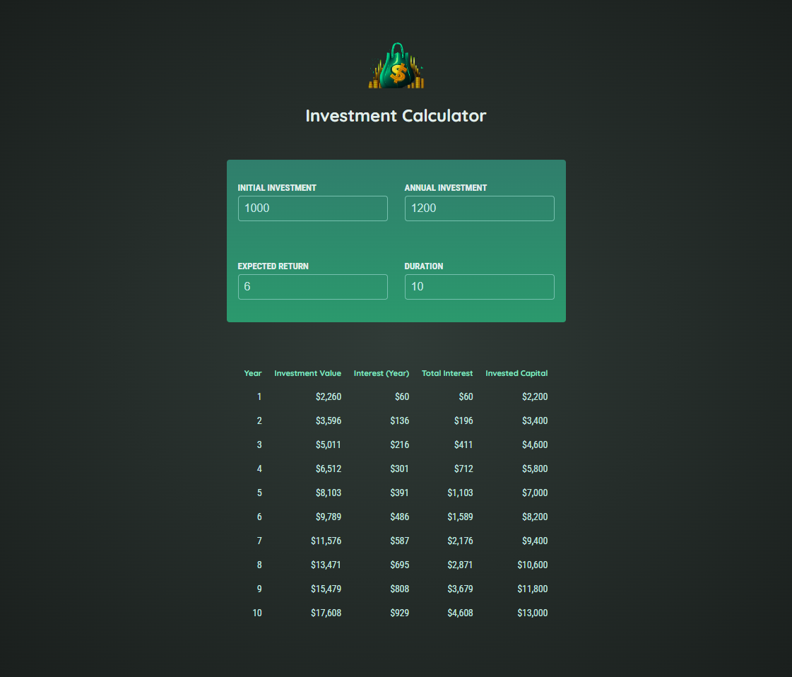
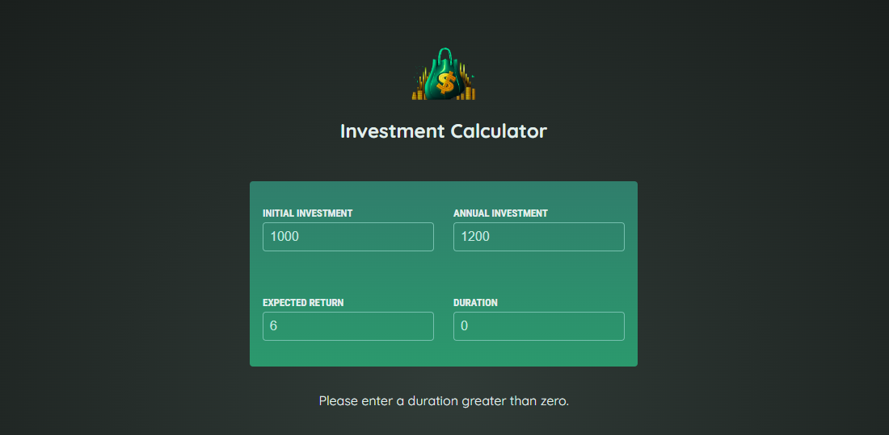

# Investment Calculator - React Course by Maximilian Schwarzmüller

This is the third project built with React, developed while following the Udemy course React - The Complete Guide 2024 (incl. Next.js, Redux), taught by Maximilian Schwarzmüller.

[Link to Udemy Course](https://www.udemy.com/course/react-the-complete-guide-incl-redux/)

## Project Description

The Investment Calculator is a tool that allows users to simulate the growth of an investment over time, based on various input parameters. Users can enter an initial investment amount, an additional annual contribution, an expected annual return rate, and an investment duration. The application calculates and displays results for each year, showing:

- **Annual Investment**: The amount added each year.
- **Annual Interest**: The interest earned each year based on the return rate.
- **End of Year Value**: The total investment value at the end of each year.

## Technologies and Libraries Used

- **HTML**: Base page structure.
- **CSS**: Styling for components and layout.
- **JavaScript (ES6+)**: Logic and interactivity.
- **React JS**: Building user interface components.

## Key Concepts Learned

Throughout this project, I strengthened several key React skills, including:

1. **State Management and Two-Way Binding**: Using state to track user data and implementing two-way binding for input fields.
2. **Event Handling and Input Management**: Using `onChange` to update values based on user input and handling data conversions.
3. **Spread Operator for Immutable State**: Applying the spread operator for efficient, immutable state updates.
4. **Component Communication**: Passing data and functions between components to manage input information and calculate results.
5. **Derived Functions and Data Calculation**: Using functions to calculate investment results from user input.

## Requirements

- **Node.js** (I used the v22.6.0 version)
- **Code Editor** like VS Code

## Installation

1. Clone the repository

```bash
git clone https://github.com/luigitarallo/3-project-essentials-practice.git
```

2. Install dependencies

```bash
npm install
```

3. Run the dev server

```bash
npm run dev
```

The app will be available at `http://localhost:5173/`

## Screenshot




